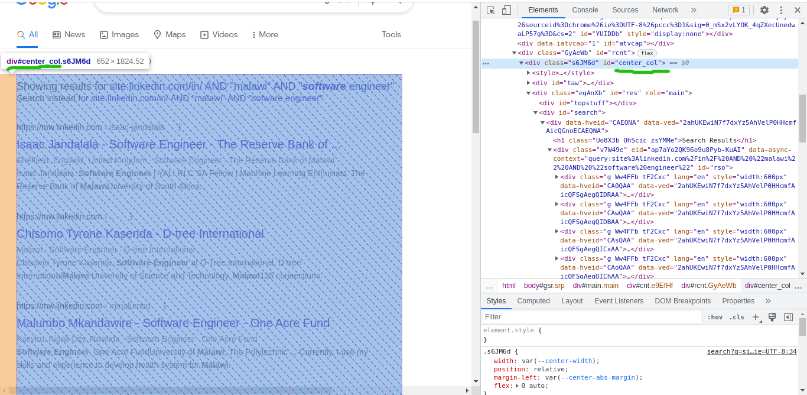

<div id="top"></div>

<br />
<div align="center">
    
</div>

<h1 align="center">
  <strong>How to Create Linkedin Profile scrapper as of 2022</strong>
</h1>

<p align="center">
Your LinkedIn profile is a professional landing page for you to manage your own, personal brand. Top companies are looking to hire top talent. A Linkedin profile that is well constructed, stands shoulder high in the pecking order. Companies are looking for profiles that are rich in information and portray workmanship. Finding top talent will need companies to swam through the Linkedin profiles of candidates.
</p>
<p align="center">
With that said, a tool that will seek to automate the mundane task of collecting profile information from LinkedIn profiles, will help make professional information readily available at one disposal, for companies to take their stance in finding their right candidate.
In this tutorial, we shall be looking on how we can create a LinkedIn profile scrapper and also outline the challenges involved.
</p>

</p>

<!-- TABLE OF CONTENTS -->
<details>
  <summary>Sections</summary>
  <ol>
    <li>
      <a href="#is-it-legal">Is it Legal?</a>
      <ul>
        <li><a href="#is-it-legal-web-scraping">Is <strong>web scraping</strong> Legal?</a></li>
        <li><a href="#is-it-legal-linkedin-scraping">Is <strong>LinkedIn scraping</strong> Legal?</a></li>
      </ul>
    </li>
    <li>
      <a href="#about-the-tutorial">About The Tutorial</a>
      <ul>
        <li><a href="#built-with">Built With</a></li>
      </ul>
    </li>
    <li>
      <a href="#getting-started">Getting Started</a>
      <ul>
        <li><a href="#prerequisites">Prerequisites</a></li>
        <li><a href="#install-dependencies">Install Dependencies</a></li>
      </ul>
    </li>
    <li>
      <a href="#steps">Steps</a>
      <ul>
        <li>
          <a href="#launch-browser">Launch Browser</a>
        </li>
        <li>
          <a href="#web-scraping">Web Scraping</a>
          <ul>
            <li><a href="#google-search-scraping">Google search scraping</a></li>
            <li><a href="#linkedin-profile-scraping">LinkedIn profile scraping</a></li>
          </ul>
        </li>
      </ul>
    </li>
    <li><a href="#creating-entry-point">Creating Entry Point to Our Project</a></li>
    <li><a href="#encountered-issues">Encountered Issues</a></li>
    <li><a href="#contact">Contact</a></li>
  </ol>
</details>

<h2 id="#is-it-legal">Is it Legal?</h2>
<h3 id="#is-it-legal-web-scraping">Is web scraping Legal?</h3>

Short answer is, yes. Scraping **publicly available information** on the web in an automated way is **legal** as long as _the scraped data is not used for any harmful purpose or directly attacking the scraped website’s business or operations_.

<p align="right">(<a href="#top">back to top</a>)</p>

<h3 id="#s-it-legal-linkedin-scraping">Is LinkedIn scraping Legal?</h3>

As it seems self-evident that public data on a website is, well, public. But, that's never stopped people from arguing that scraping data from public websites _is somehow illegal_.  
According to [LinkedIn user agreements](https://www.linkedin.com/legal/user-agreement#dos),

> ###### **You agree that you will not:**
>
> - Develop, support or use software, devices, scripts, robots or any other means or processes (including crawlers, browser plugins and add-ons or any other technology) to scrape the Services or otherwise copy profiles and other data from the Services;

LinkedIn does not allow scraping on the users' publicly available data.

Now, the [U.S. Ninth Circuit Court of Appeals](https://www.ca9.uscourts.gov/) has ruled in the [hiQ Labs, Inc. v. LinkedIn Corp.](https://cdn.ca9.uscourts.gov/datastore/opinions/2022/04/18/17-16783.pdf) that LinkedIn can't stop its competitor, hiQ Labs, from scraping LinkedIn users' publicly available data, _a case which has been dragging for almost 5 Years now_.  
As of 2022, web scraping is legal and beware that LinkedIn will try to block you when scraping the users' publicly available data on their website.

<p align="right">(<a href="#top">back to top</a>)</p>

<!-- ABOUT THE PROJECT -->

<h2 id="about-the-tutorial">About The Tutorial</h2>

In this tutorial we will be using [puppeteer](https://npmjs.com/package/puppeteer).  
Most things that you can do manually in the browser can be done using Puppeteer.  
Puppeteer will search for linkedIn profiles through a google search and retrieve the profile URLs of **publicly available** LinkedIn profiles that will generally have the format of `https://ca.linkedin.com/in/linkedin-user`. Basically, the URLs have a country code to where the user has set his/her location on their profile.
Puppeteer uses a chromium browser that is maintained by the chrome browser team.

<p align="right">(<a href="#top">back to top</a>)</p>

<h3 id="built-with">Built With</h3>

- [NodeJs](https://www.nodejs.org/)
<p align="right">(<a href="#top">back to top</a>)</p>

<!-- GETTING STARTED -->

<h2 id="getting-started">Getting Started</h2>

<h3 id="prerequisites">Prequisites</h3>

- You need to have [NodeJs](https://nodejs.org/en/download/) and `npm` installed on your computer. `npm` comes bundled together with Nodejs.

- Create our working folder `mkdir linkedin_scraper` and change into that folder `cd linkedin_scraper`.

- Create a `package.json` file by running `npm init` in the terminal opened at the root of our working folder.

<h3 id="installation">Installation</h3>

We shall be pulling in packages from the npm repository. Run:

```sh
npm install puppeteer cheerio
```

to install the packages.

<p align="right">(<a href="#top">back to top</a>)</p>

<!-- USAGE EXAMPLES -->

<h2 id="steps">Steps</h2>

<h3 id="launch-browser">Launch Browser</h4>

Let's kickstart our development.  
A the project root, let's create `browser.js` file and add the below code in it.

```javascript
const puppeteer = require("puppeteer");

async function startBrowser() {
  let browser;
  try {
    console.log("Opening the browser......");
    browser = await puppeteer.launch({
      headless: false,
      args: ["--no-sandbox", "--disable-setuid-sandbox"],
      ignoreHTTPSErrors: true,
      userDataDir: "./data",
    });
  } catch (err) {
    console.log("Could not create a browser instance => : ", err);
  }
  return browser;
}

module.exports = {
  startBrowser,
};
```

We use puppeteer to launch our browser inside our `startBrowser` function definition:

```javascript
browser = await puppeteer.launch({
  headless: false,
  args: ["--no-sandbox", "--disable-setuid-sandbox"],
  ignoreHTTPSErrors: true,
  userDataDir: "./data",
});
```

We pass an options object to puppeteer:  
`headless: false`: We set the headless to false to see Browser actions. Without it, things will run without anything visual.  
`args: ["--no-sandbox", "--disable-setuid-sandbox"]`: To disable the sandBox environment.  
`ignoreHTTPSErrors: true`: To ignore https errors.  
`userDataDir`: Path to a user data directory.

We then export our function `startBrowser` as a named export

```javascript
module.exports = {
  startBrowser,
};
```

<p align="right">(<a href="#top">back to top</a>)</p>

<h3 id="web-scraping">Web Scraping</h3>
At this point we shall create scrapping Logic in the steps:

1. Perform google search and scrap the linkedIn public URLs from the search results.

2. Use the obtained LinkedIn URLs to scrap profile information. _Remember, at this point is where LinkedIn will try to block us_.

We create a folder named `scrapper` created at the root of our project. Then inside of our `scrapper` folder we create two files: `index.js` and `scrapper.js`.

Let's shift focus to `index.js` file we have created in the path: `./scraper/index.js`(_from the project root_).  
Paste in the following code in the opened `index.js` file.

```javascript
const { startBrowser } = require("../browser.js");
const scrapper = require("./scrapper.js");

/**
 * Get profile info  from linkedin public profiles
 * @param {Object} searchValue - object with region and title to search
 * @param {string} searchValue.region - region to search
 * @param {string} searchValue.title - title to search
 */
async function linkedinScrapper(
  searchValue = { region: "canada", title: "software developer" }
) {
  const { region, title } = searchValue;
  const baseUrl = "https://www.google.com";
  const searchEndPoint = "/search?q=";
  const searchQuery = encodeURIComponent(
    `site:linkedin.com/in/ AND ${region} AND ${title}`
  );
  const searchUrl = baseUrl + searchEndPoint + searchQuery;

  try {
    const browserReady = await startBrowser();
    scrapper(browserReady, searchUrl);
  } catch (error) {
    console.log(error.message);
    console.log(error.stack);
  }
}

module.exports = linkedinScrapper;
```

We have imported the function that will launch our browser `const { startBrowser } = require("../browser.js");` and the module where our scraping logic will go `const scrapper = require("./scrapper.js");`.

We have then created a function, `async function linkedinScrapper(searchValue = { region: "canada", title: "software developer" }) {}`, that will pull in the scraping logic from the `scrapper.js` file, that we will define later.  
You may give your function any name but I chose `linkedinScrapper` because, despite scraping google search results as well, our end goal is scraping linkedin profiles for data.  
We assign the default values of `searchValue = { region: "canada", title: "software developer" }` to the `searchValue` parameter of our `linkedinScrapper` function.

```javascript
const { region, title } = searchValue;
const baseUrl = "https://www.google.com";
const searchEndPoint = "/search?q=";
const searchQuery = encodeURIComponent(
  `site:linkedin.com/in/ AND ${region} AND ${title}`
);
const searchUrl = baseUrl + searchEndPoint + searchQuery;
```

Inside our `linkedinScrapper` function, we construct a google search url with a search query of `site:linkedin.com/in/ AND ${region} AND ${title}`, with the `${region}` and `${title}` obtained from function parameters. We are utilizing [Google dorks](https://www.exploit-db.com/google-hacking-database) to search publicly available information and to tailor our search results. This Search Query will search for linkedin profiles that contain information about the `${region}` and `${title}`. We pass the search URL to the function that will hold our logic `scrapper(browserReady, searchUrl);`;

Then we call `const browserReady = await startBrowser();` to launch browser and pass the instance to the scrapper function also `scrapper(browserReady, searchUrl);`.

#### Next Step

Next we navigate to `scrapper.js` file at the path `./scrapper/scrapper.js`(_relative to the project root_).  
We start off by initializing:

```javascript
const cheerio = require("cheerio");

const isLinkedinPublicUrl =
  /^https:\/\/(\w{2})\.linkedin.com\/in\/[a-zA-Z0-9-]+(\/[a-zA-Z0-9-]+)?\/?$/g;
let nextPageUrl;
let linkdinProfileURLs = [];
let browserPage;
let profileData = [];

/**
 *
 * @param {object} browser - Browser Instance
 * @param {string} searchUrl - Url to search
 * @param {number} [resultsLength=10] - Number of results to fetch
 */
async function init(browser, searchUrl, resultsLength = 10) {
  browserPage = await browser.newPage();
  await getLinkedinProfileUrls(searchUrl);
  await getLinkedinProfileData();
  return { nextPageUrl, linkdinProfileURLs, profileData };
}
```

We have created an `init()` function that will create a new browser page `browserPage = await browser.newPage();` before simultaneously executing `await getLinkedinProfileUrls(searchUrl);`(_google search for linkedin profiles_) and `await getLinkedinProfileData();`(_scrap data from linkedIn profiles with URLs gotten from google search_).  
We then return an **Object** that will carry the results of our scrapping `return { nextPageUrl, linkdinProfileURLs, profileData }`  
Also we have set global variables that will have a global scope in the module and thus make them accessible from each function.
`isLinkedinPublicUrl` is our global variable containing regular expression that will be used to match LinkedIn **public** profile URLs generally in the form of <code>https://<small><em>\[contry_code\]</em></small>.linkedin.com/in/<small><em>\[user-profile-name\]</em></small></code>

<p align="right">(<a href="#top">back to top</a>)</p>

<h4 id="google-search-scraping">Google Search Scraping</h4>

While still in the same file `scrapper.js`, let us define `getLinkedinProfileUrls` function that will do the actual google search for getting links to linkedin's users' publicly available profile information.

```javascript
/**
 *
 * @param {string} searchUrl - Url to search
 */
async function getLinkedinProfileUrls(searchUrl) {
  try {
    console.log(`Searching %s ...`, searchUrl);
    await browserPage.goto(searchUrl, { waitUntil: "domcontentloaded" });

    // Wait for the selector to appear within DOM
    await browserPage.waitForSelector("#center_col");
    const html = await browserPage.evaluate(() => {
      // container containing search results and navigation presentation
      const searchResultsMain = document.getElementById("center_col").innerHTML;
      return searchResultsMain;
    });

    // to be continued...
  } catch (error) {
    throw new Error(error);
  }
}
```

We have used the global variable `browserPage` that is assigned when we call the `init` function. We thereafter do our google search by running `await browserPage.goto(searchUrl, { waitUntil: "domcontentloaded" });`, and wait until the DOM is completely parsed before we can continue.  
Thereafter we make sure that the DOM element we want to extract is in the DOM, if not then wait until timeout before we can throw an error `await browserPage.waitForSelector("#center_col");`. _Just keep in mind that SPAs(Single Page Applications) will build DOM using javascript_.

We know our search results will be in the `#center_col` element because if you open your browser and type in the search `site:linkedin.com/in/ AND "malawi" AND "software engineer"`, open your browser dev tools, this is what you should observe.

<br /><br />

After we get our target DOM element, we can then proceed to get the `innerHTML` as a string result.  
_The below piece of the snippet shows how we get the `innerHTML`_

```javascript
// Execute javascript on the page
const html = await browserPage.evaluate(() => {
  // Container containing search results and navigation presentation
  const searchResultsMain = document.getElementById("center_col").innerHTML;
  return searchResultsMain;
});
```

`await browserPage.evaluate` will help us to execute javascript on the page, like we would in a normal browser.

#### Next step

The HTML string we return here, in the next step we load into our `cheerio` package to parse it and get the information we need.

```javascript
async function getLinkedinProfileUrls(searchUrl) {
  try {
    /**
     * --- PREVIOUS CODE HERE ---
     */
    //  continuation...

    // Traverse the returned HTML sring
    const $ = cheerio.load(html, null, false);
    const extractLinkdinUrls = $(
      "div#search div div div.g div div div > a"
    ).each((i, elem) => {
      const href = elem.attribs?.href;
      //   console.log(`-- ${href} --`)

      if (href && href.indexOf("linkedin.com") > -1) {
        // match linkedin URLs
        const frmLinkedin = isLinkedinPublicUrl.test(href);

        if (frmLinkedin) {
          linkdinProfileURLs.push(href);
        }
      }
    });

    // to be continued...
  } catch (error) {
    throw new Error(error);
  }
}
```

As in the snippet above `const $ = cheerio.load(html, null, false);`, we have loaded our HTML string into cheerio package so that we may traverse the html string, with a [Jquery-like](https://api.jquery.com/) syntax.  
We traverse the loaded html string to:

- Find the linkedIn profile URLs in the search results
  ```javascript
  const extractLinkdinUrls = $("div#search div div div.g div div div > a");
  ```
- Loop through each anchor tags to get the `href` attribute:

  ```javascript
  const extractLinkdinUrls = $("div#search div div div.g div div div > a").each(
    (i, elem) => {
      const href = elem.attribs?.href;
    }
  );
  ```

  - Then test if `href` has a value. If it has a value, test the value against a regex to ensure it is a public LinkedIn profile URL

  ```javascript
  if (href && href.indexOf("linkedin.com") > -1) {
    // match linkedin URLs
    const frmLinkedin = isLinkedinPublicUrl.test(href);
  }
  ```

  - If it is a public LinkedIn Url, add it to our `linkdinProfileURLs` global variable Array.

  ```javascript
  if (frmLinkedin) {
    linkdinProfileURLs.push(href);
  }
  ```

#### Next Step

In the next step, we need to extract the link that has URL to take us to the next page of our results

```javascript
async function getLinkedinProfileUrls(searchUrl) {
  try {
    /**
     * --- PREVIOUS CODE HERE ---
     */
    //  continuation...

    // We pick the URL of the next browserPage, since active browserPage is
    // `td` that has a class attribute on it
    // and without an aria-level attribute and is not a first-child
    // The next browserPage is the sibling next to this `td` identified
    const extractnxtPgLink = $(
      "div[role='navigation'] table[role='presentation'] tbody tr td[class]:not([aria-level]):not(:first-of-type)"
    )
      .next()
      .children()[0];

    // assign the next page link to the global variable nextPageUrl
    nextPageUrl = $(extractnxtPgLink).attr("href");
  } catch (error) {
    throw new Error(error);
  }
}
```

We traverse our html to find the link `href` attributes that contain link to the next page. Then we set our `nextPageUrl` global variable to the link address we have obtained.

<p align="right">(<a href="#top">back to top</a>)</p>

<!-- LINKEDIN SCRAPING -->
<h4 id="linkedin-profile-scraping">LinkedIn Profile Scraping</h4>

While still in our file `scrapper.js`, we create our `getLinkedinProfileData` function

```javascript
/**
 * Get linkedin profile information
 */
async function getLinkedinProfileData() {
  try {
    for (let i = 0; i < linkdinProfileURLs.length; i++) {
      const link = linkdinProfileURLs[i];
      await browserPage.goto(link, { waitUntil: "domcontentloaded" });
      await browserPage.waitForSelector("#main-content");
      const html = await browserPage.evaluate(() => {
        // Traverse DOM
        // Container containing profile info
        const searchResultsMain =
          document.querySelector(".core-rail").innerHTML;
        // console.log("searchResultsMain ", searchResultsMain);
        return searchResultsMain;
      });

      // to be continued...
    }
  } catch (error) {
    throw new Error(error);
  }
}
```

We loop through our array collection of LinkedIn profiles `linkdinProfileURLs` populated by our google search. For each url, we browse to view the profile of the associated user, logic defined by the piece of code as shown below:

```javascript
for (let i = 0; i < linkdinProfileURLs.length; i++) {
  const link = linkdinProfileURLs[i];
  await browserPage.goto(link, { waitUntil: "domcontentloaded" });
}
```

We wait for the DOM content to be completely parsed.

#### Next Step

```javascript
async function getLinkedinProfileData() {
  try {
    for (let i = 0; i < linkdinProfileURLs.length; i++) {
      const link = linkdinProfileURLs[i];
      /**
       * --- PREVIOUS CODE HERE ---
       */
      //  continuation...

      await browserPage.waitForSelector("#main-content");
      const html = await browserPage.evaluate(() => {
        // Traverse DOM
        // Container containing profile info
        const searchResultsMain =
          document.querySelector(".core-rail").innerHTML;
        return searchResultsMain;
      });

      // to be continued...
    }
  } catch (error) {
    throw new Error(error);
  }
}
```

Thereafter we wait for the element with id `#main-content` to be populated.  
We then run our javascript to interact with the DOM on the page, to obtain the content of our `#main-content` html element as string. We return this string content and store in the `html` variable.

#### Next Step

We load our obtained `html` string to our html parser(`cheerio`) to traverse the html using the Jquery syntactic sugar and get results we need.

```javascript
async function getLinkedinProfileData() {
  try {
    for (let i = 0; i < linkdinProfileURLs.length; i++) {
      const link = linkdinProfileURLs[i];
      /**
       * --- PREVIOUS CODE HERE ---
       */
      //  continuation...

      // Traverse the HTML sring
      const $ = cheerio.load(html, null, false);
      const profileContainer = $(".profile");
      const profileCard = $(profileContainer).find(
        ".top-card-layout .top-card-layout__card"
      );

      const extractProfileName = $(profileCard)
        .find(
          ".top-card-layout__entity-info-container .top-card-layout__entity-info:first-child .top-card-layout__title"
        )
        .text();

      const extractProfileHeadline = $(profileCard)
        .find(
          ".top-card-layout__entity-info-container .top-card-layout__entity-info:first-child .top-card-layout__headline"
        )
        .text();

      const extractAboutHtml = $(profileContainer)
        .find(".core-section-container .core-section-container__content")
        .children()[0];
      const extractAbout = $(extractAboutHtml).text();

      // Attach the extracted profile information to an object,
      // removing line breaks and trailing whitespaces
      let profile = {
        profileImage: extractProfileImg,
        name: String(extractProfileName)
          .replace(/(\r\n|\n|\r)/gm, "")
          .trim(),
        title: String(extractProfileHeadline)
          .replace(/(\r\n|\n|\r)/gm, "")
          .trim(),
        about: String(extractAbout)
          .replace(/(\r\n|\n|\r)/gm, "")
          .trim(),
      };

      // Push our new profile to array store
      profileData.push(profile);
    }
  } catch (error) {
    throw new Error(error);
  }
}
```

We have looped through our `linkdinProfileURLs` array, browsing to every url in the array and obtaining useful information we need from HTML page and converting it to a consumable format (_javascript object_). The obtained information is then incrementally stored in our `profileData` array.

<p align="right">(<a href="#top">back to top</a>)</p>

<h2 id="creating-entry-point">Creating an Entry Point to our project</h2>

We have written down the logic that we will need to scrape for data. What have not done is to create an entry point of our project where all the functionality is pulled into one central point.  
In our root project folder, we create an `index.js` file that will have the following code:

```javascript
const linkedinScrapper = require("./scrapper/index.js");

const region = "canada";
const title = "golang developer";

linkedinScrapper({ region, title });
```

We have simply imported our scrapper logic module and then called it providing object argument that will contain the `region` and `title` we would like to scrap for.  
This is great. We can now run our project by typing in the commandline `node index.js`, and see how our project runs.

<p align="right">(<a href="#top">back to top</a>)</p>

<h2 id="encountered-issues">Encountered Issues</h2>

We have seen linked does not want you to scrap profile information of it's users. So it is always working on fine-tuning algorithms to try and detect automated bot activity running on its websites.  
When trying to access LinkedIn profiles anonymously(withou logging in), you will come across a **notorious authwall** requiring you to first log in.

Some of the reasons you may get blocked include:

- If you visit a public profile from a non-residential IP address, such as from a data center IP address, you will get the Authwall.
- If you visit a public profile without any cookies in your browser session (aka incognito mode), you will get the Authwall.
- If you are visiting a public profile from a non-major browser, you will get the Authwall.
- If you are visiting a public profile multiple times, you will get the Authwall.

So you can see the crossroads. We want to access the profile information that is available publicly, but LinkedIn is acting mean. But we want this data;  
So I found a temporary way to circumvent this authwall is to browse the linkedIn URLs at interleaved intervals.  
_Please not that this method not always works_

Therefore in our function `getLinkedinProfileData` that scraps to get linked profile information, we shall modify it a bit to allow for some idle period before trying to browse the next url information like shown below:

```javascript
function breathingSpace(t) {
  return new Promise((r) => {
    setTimeout(r, t);
  });
}

async function getLinkedinProfileData() {
  try {
    for (let i = 0; i < linkdinProfileURLs.length; i++) {
      // Wait for 2 secondes before performing logic
      // to scrap the next Linkedin Profile information
      await breathingSpace(2000);
      const link = linkdinProfileURLs[i];
      await browserPage.goto(link, { waitUntil: "domcontentloaded" });
      /**
       * --- REST OF CODE HERE ---
       */
    }
  } catch (error) {
    throw new Error(error);
  }
}
```

We create a new function `breathingSpace` that returns a promise and just holds the process for `n` seconds before proceeding. We call that function in every iteration of getting the LinkedIn information and simulate _a wait effect_ or call it _pause_ as to your liking.

<!-- CONTACT -->

<h2 id="contact">✉️ Contact</h2>

Zacky - [@SmitterHane](https://twitter.com/SmitterHane) - hanesmitter3@gmail.com

Project Link: [https://github.com/hane-smitter/linkdin_profile_scrapper](https://github.com/hane-smitter/linkdin_profile_scrapper)

<p align="right">(<a href="#top">back to top</a>)</p>
